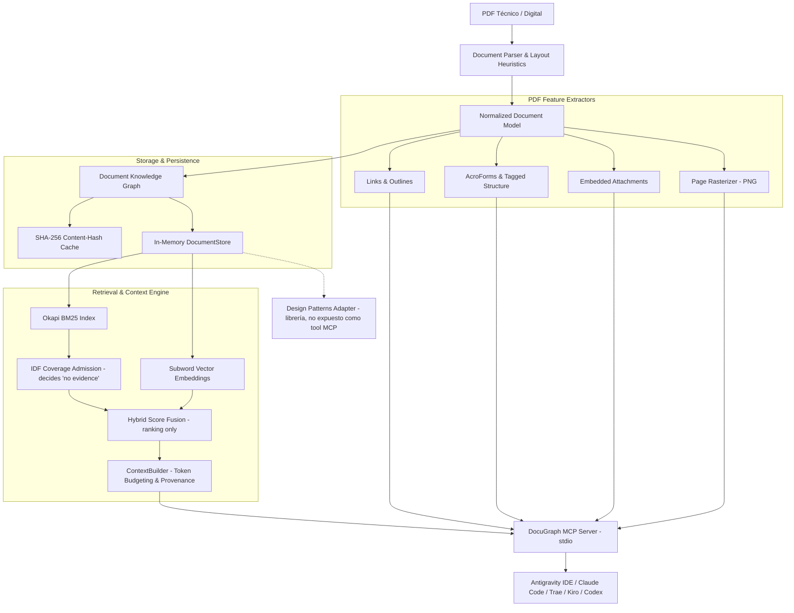

# DocuGraph MCP

[](https://github.com/yoiberdev/docugraph-mcp/actions/workflows/ci.yml)
[](https://opensource.org/licenses/MIT)
[](https://www.rust-lang.org/)
[](https://modelcontextprotocol.io/)
[](https://ko-fi.com/yoiberdev)
[](https://buymeacoffee.com/yoiber)

**DocuGraph MCP** es un servidor [Model Context Protocol (MCP)](https://modelcontextprotocol.io/) de alto rendimiento escrito en **Rust**, diseñado para transformar documentos PDF complejos (manuales técnicos, libros de arquitectura, especificaciones, RFCs) en un **grafo estructurado de conocimiento y evidencia** que los agentes de IA pueden consultar sin saturar su contexto con páginas innecesarias.

---

## 💡 ¿Por qué no un RAG tradicional?

El RAG ingenuo convencional (`PDF → chunks ciegos de ventana fija → embeddings → top-k → prompt`) sufre de tres problemas críticos al trabajar con documentación técnica:
1. **Pérdida de jerarquía:** Los chunks ciegos rompen la relación entre capítulos, encabezados H1-H2-H3, métodos y secciones padre.
2. **Desperdicio de contexto ("Lost in the Middle"):** Se inyectan decenas de páginas redundantes que agotan la ventana de contexto del LLM y degradan su capacidad de razonamiento.
3. **Falta de evidencia verificable (Provenance):** El agente no puede citar exactamente en qué página, sección o párrafo se sustenta una afirmación.

**DocuGraph** aborda esto desde los primeros principios de diseño:
* **Grafo Documental Jerárquico:** Extrae marcadores nativos (`/Outlines`) o infiere jerarquías tipográficas preservando la estructura real del libro.
* **Retrieval Híbrido Calibrable:** Combina búsqueda léxica BM25 ($k_1=1.2, b=0.75$) con similitud semántica de coseno y bonificación estructural por títulos.
* **Presupuesto Adaptativo de Contexto (Context Budgeting):** Las herramientas devuelven la mínima evidencia requerida, permitiendo al agente expandir secciones o vecinos bajo demanda.
* **Zero Overhead en Local:** Escrito en Rust como binario único, con arranque instantáneo (<15 ms) y consumo inferior a 25 MB de RAM en reposo.

---

## 🏗️ Arquitectura del Sistema



---

## 🚀 Instalación y Quickstart

### Prerrequisitos
* Rust (Edición 2024 / versión 1.85+ recomendada).

### Compilación local
```bash
git clone https://github.com/yoiberdev/docugraph-mcp.git
cd docugraph-mcp
cargo build --release
```

El binario autocontenido quedará disponible en `./target/release/docugraph` (o `docugraph.exe` en Windows).

---

## 💻 Uso de la CLI

DocuGraph incluye una interfaz de línea de comandos intuitiva para preparar y explorar documentos antes o durante el trabajo con agentes:

```bash
# 1. Indexar un documento PDF (o carpeta completa recursivamente) en el grafo
docugraph index ./ruta/documento.pdf
docugraph index ./manuales/

# 2. Listar todos los documentos indexados en caché
docugraph list

# 3. Ver resumen estructural y árbol de secciones de un documento
docugraph info <document_id_o_ruta>

# 4. Realizar búsqueda híbrida directa desde consola
docugraph search "trunk based development" --limit 5

# 5. Iniciar servidor MCP en modo stdio (comunicación JSON-RPC universal)
docugraph serve
```

---

## 🛠️ Herramientas MCP Disponibles (100% Agnósticas al Dominio)

DocuGraph expone una suite de herramientas diseñada para el descubrimiento progresivo de cualquier tipo de documento técnico, científico o profesional:

| Herramienta | Parámetros principales | Descripción |
| ----------- | ---------------------- | ----------- |
| `document_ping` | `message` (opcional) | Comprueba la salud del servidor y la latencia stdio. |
| `document_list` | *(ninguno)* | Lista todos los PDFs indexados, hashes SHA-256 y conteo de páginas. |
| `document_info` | `document_id` | Devuelve metadatos y vista previa del esquema de secciones. |
| `document_outline` | `document_id`, `max_depth` | Extrae el árbol jerárquico de navegación con rangos de página exactos. |
| `document_search` | `query`, `document_id`, `limit` | Búsqueda léxica rápida mediante Okapi BM25. |
| `document_search_hybrid` | `query`, `document_id`, `limit`, `bm25_weight`, `semantic_weight`, `structural_weight` | Búsqueda híbrida ponderada (palabras clave + semántica + títulos). |
| `document_get_section` | `document_id`, `section_id`, `include_parent`, `max_tokens` | Recupera el texto de una sección con contexto de padre y límite de tokens. |
| `document_get_context` | `query`, `document_id`, `max_tokens`, `max_chunks` | Expande el contexto circundante (sección padre, hermanos y sub-cláusulas) para un concepto dentro de un presupuesto estricto. |
| `document_get_evidence` | `query`, `document_id`, `max_tokens`, `max_items` | Fragmentos compactos de evidencia con citas estrictas `[Doc: ... p. ... § ...]` para razonamiento factual. |
| `document_read_pages` | `document_id`, `page_start`, `page_end`, `max_chars` | Lectura directa de rango de páginas con presupuesto de caracteres. |
| `document_render_page` | `document_id`, `page_number`, `max_width` | Rasteriza una página a PNG (base64) para modelos con visión. Ver la nota de fidelidad más abajo. |
| `document_get_links` | `document_id`, `page`, `kind` | Grafo de hipervínculos: URIs externas y destinos internos con su página de llegada. |
| `document_get_forms` | `document_id`, `page`, `filled_only` | Campos de formularios AcroForm con nombre cualificado, tipo, valor y posición. |
| `document_get_attachments` | `document_id` | Lista los ficheros embebidos (`/EmbeddedFiles`, `/AF`, `/FileAttachment`). |
| `document_read_attachment` | `document_id`, `name_or_id`, `max_bytes`, `encoding` | Lee el contenido de un fichero embebido como texto o base64. |

> **Sobre `document_render_page`:** el rasterizador es propio y sin dependencias nativas. Dibuja bloques
> por fragmento de texto y no interpreta operadores de trazado, así que sirve para juzgar la *maqueta* de
> una página (columnas, tablas, densidad), no para leer sus glifos ni sus diagramas vectoriales.

### Cuando no hay evidencia

`document_get_evidence` y `document_get_context` pueden responder que **no** encontraron nada. Un pasaje
cuenta como evidencia cuando contiene al menos la información media de un término de la consulta, medida
en IDF sobre el propio corpus; si ninguno llega, la herramienta devuelve `### Sin evidencia para: '...'`
junto con los términos de la consulta que no aparecen en el documento. Es una respuesta válida, no un
error: preferimos que el agente sepa que el corpus no cubre la pregunta a que reciba citas de secciones
que no vienen a cuento.

---

## 🤖 Ejemplo de Razonamiento del Agente

A diferencia de un bot que responde texto plano sin respaldo, un agente conectado a DocuGraph razona con evidencia verificable sobre cualquier documento técnico:

```text
Usuario:
"Analiza este flujo de sincronización y recomiéndame la mejor estrategia según el manual técnico."

Agente:
"Voy a consultar la base de conocimiento estructurada del documento..."

→ Llama a: document_search_hybrid("estrategias de sincronización y ramas")
← Recibe: Sección "1.1 Ramas Locales" (pp. 37-40, score: 0.88) y Sección "1.2 Fusión" (pp. 41-44)

→ Llama a: document_get_context(query: "estrategias de sincronización", document_id: "manual-git")
← Recibe: Contexto conceptual circundante, encabezado padre y subsecciones relacionadas

→ Llama a: document_get_evidence(query: "estrategia de ramas locales de integración continua")
← Recibe: Fragmentos compactos de alta relevancia con citas formales

Agente:
"Te recomiendo utilizar una estrategia basada en ramas cortas (Trunk-Based Development).
Según el documento técnico (pp. 37-38, § 1.1 Ramas Locales):
- Permite reducir los conflictos de integración continua fusionando diariamente.
- Evita el aislamiento de código prolongado entre desarrolladores.

Evidencia: [Doc: manual-git p. 37 § ramas-locales]"
```

---

## ⚙️ Configuración en Clientes MCP

DocuGraph se comunica mediante **stdio (JSON-RPC 2.0)** manteniendo `stdout` estrictamente limpio (los logs estructurados se emiten exclusivamente a `stderr`).

### Antigravity IDE
Agrega la configuración en tu archivo `mcp_config.json`:

```json
{
  "mcpServers": {
    "docugraph": {
      "command": "cargo",
      "args": ["run", "--manifest-path", "C:/proyectos/docugraph-mcp/Cargo.toml", "--release", "--quiet", "--", "serve"],
      "env": {
        "RUST_LOG": "info"
      }
    }
  }
}
```

### Claude Desktop / Claude Code / Trae / Kiro
```json
{
  "mcpServers": {
    "docugraph": {
      "command": "C:/proyectos/docugraph-mcp/target/release/docugraph.exe",
      "args": ["serve"]
    }
  }
}
```

---

## ☕ Apoya el Proyecto / Sponsor & Support

DocuGraph MCP es un proyecto open-source desarrollado de forma independiente con dedicación, cariño y rigor técnico para la comunidad de desarrolladores y agentes de IA.

Si esta herramienta te resulta útil, te ahorra tiempo o mejora tus flujos de trabajo con LLMs, cualquier muestra de apoyo o café es recibida con **inmensa gratitud y humildad**. ¡Ayuda directamente a mantener el proyecto activo, optimizado y en constante evolución!

<p align="center">
  <a href="https://ko-fi.com/yoiberdev" target="_blank">
    
  </a>
  &nbsp;&nbsp;&nbsp;&nbsp;
  <a href="https://buymeacoffee.com/yoiber" target="_blank">
    
  </a>
</p>

* **Ko-fi:** [ko-fi.com/yoiberdev](https://ko-fi.com/yoiberdev)
* **Buy Me a Coffee:** [buymeacoffee.com/yoiber](https://buymeacoffee.com/yoiber)

---

## ⚖️ Licencia y Uso de Documentos (Copyright Notice)

* **DocuGraph MCP** se distribuye bajo la [Licencia MIT](LICENSE).
* **Uso de documentos protegidos:** DocuGraph **NO** incluye ni redistribuye libros protegidos por derechos de autor. Cada usuario es responsable de proveer sus propios PDFs legítimos en su entorno local.
* Para pruebas y CI, se utilizan suites sintéticas libres de derechos en `tests/` y `evaluation/`.
