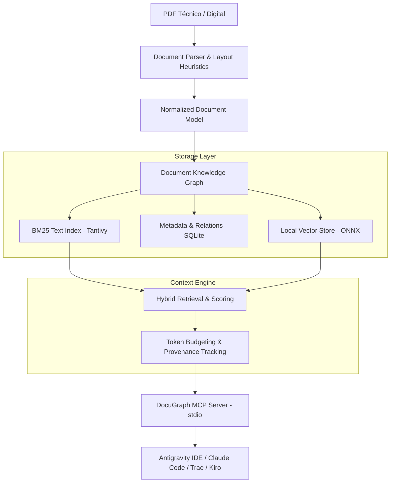

# DocuGraph MCP

[](https://github.com/yoiberdev/docugraph-mcp/actions/workflows/ci.yml)
[](https://opensource.org/licenses/MIT)
[](https://www.rust-lang.org/)
[](https://modelcontextprotocol.io/)

**DocuGraph MCP** es un servidor [Model Context Protocol (MCP)](https://modelcontextprotocol.io/) de alto rendimiento escrito en **Rust**, diseñado para transformar documentos PDF complejos (manuales técnicos, libros de arquitectura, especificaciones, RFCs) en un **grafo estructurado de conocimiento y evidencia** que los agentes de IA pueden consultar sin saturar su contexto con páginas innecesarias.

---

## 💡 ¿Por qué no un RAG tradicional?

El RAG ingenuo convencional (`PDF → chunks ciegos → embeddings → top-k → prompt`) sufre de tres problemas críticos al trabajar con documentación técnica:
1. **Pérdida de jerarquía:** Los chunks pierden la relación entre capítulos, secciones padre, tablas y subtemas.
2. **Desperdicio de contexto:** Se inyectan fragmentos redundantes que agotan la ventana de contexto del LLM.
3. **Falta de evidencia (Provenance):** El agente no puede verificar exactamente en qué página, sección o párrafo se sustenta una afirmación.

**DocuGraph** aborda esto desde el diseño:
* **Grafo documental:** Conserva la jerarquía tipográfica y estructural del documento.
* **Retrieval Híbrido:** Combina búsqueda léxica BM25 (vía `tantivy`) con búsqueda semántica y filtrado estructural.
* **Presupuesto Adaptativo de Contexto:** Las herramientas devuelven la mínima evidencia requerida, permitiendo al agente expandir secciones o vecinos bajo demanda.
* **Zero Overhead en Local:** Escrito en Rust como binario único, con arranque instantáneo (<10ms) y consumo < 30 MB de RAM en segundo plano.

---

## 🏗️ Arquitectura



---

## 🚀 Instalación y Quickstart

### Prerrequisitos
* Rust (Edición 2024 / versión 1.85+ recomendada).

### Compilación local
```bash
git clone https://github.com/yoiberdev/docugraph-mcp.git
cd docugraph-mcp
cargo build --release
```

El binario quedará disponible en `./target/release/docugraph`.

---

## 💻 Uso de la CLI

```bash
# 1. Indexar un documento PDF en el grafo
docugraph index ./ruta/documento.pdf

# 2. Listar documentos indexados
docugraph list

# 3. Ver resumen estructural de un documento
docugraph info <document_id>

# 4. Iniciar servidor MCP en modo stdio
docugraph serve
```

---

## ⚙️ Configuración como Servidor MCP

DocuGraph se comunica mediante **stdio (JSON-RPC 2.0)** manteniendo `stdout` estrictamente limpio (los logs estructurados se emiten exclusivamente a `stderr`).

### Antigravity IDE
Agrega la configuración en `mcp_config.json` o en tu configuración de agentes:

```json
{
  "mcpServers": {
    "docugraph": {
      "command": "cargo",
      "args": ["run", "--manifest-path", "C:/proyectos/docugraph-mcp/Cargo.toml", "--release", "--quiet", "--", "serve"],
      "env": {
        "RUST_LOG": "info"
      }
    }
  }
}
```

### Claude Desktop / Trae / Kiro
```json
{
  "mcpServers": {
    "docugraph": {
      "command": "C:/proyectos/docugraph-mcp/target/release/docugraph.exe",
      "args": ["serve"]
    }
  }
}
```

---

## 🛠️ Desarrollo y Contribución

Consulta nuestras directrices en [`CONTRIBUTING.md`](file:///CONTRIBUTING.md) y [`docs/git-workflow.md`](file:///docs/git-workflow.md) para conocer el modelo de ramas (*Simplified Trunk-Based*), la convención de commits semánticos y la política de etiquetado de releases.

```bash
# Validar antes de enviar PR
cargo fmt --all -- --check
cargo clippy --all-targets -- -D warnings
cargo test --all
```

---

## 📄 Licencia

Este proyecto está bajo la Licencia MIT. Consulta el archivo [`LICENSE`](file:///LICENSE) para más detalles.
