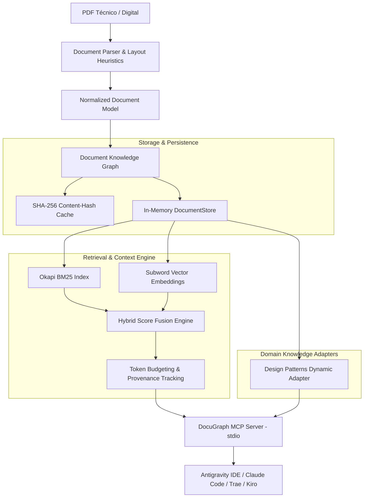

# DocuGraph MCP

[](https://github.com/yoiberdev/docugraph-mcp/actions/workflows/ci.yml)
[](https://opensource.org/licenses/MIT)
[](https://www.rust-lang.org/)
[](https://modelcontextprotocol.io/)

**DocuGraph MCP** es un servidor [Model Context Protocol (MCP)](https://modelcontextprotocol.io/) de alto rendimiento escrito en **Rust**, diseñado para transformar documentos PDF complejos (manuales técnicos, libros de arquitectura, especificaciones, RFCs) en un **grafo estructurado de conocimiento y evidencia** que los agentes de IA pueden consultar sin saturar su contexto con páginas innecesarias.

---

## 💡 ¿Por qué no un RAG tradicional?

El RAG ingenuo convencional (`PDF → chunks ciegos de ventana fija → embeddings → top-k → prompt`) sufre de tres problemas críticos al trabajar con documentación técnica:
1. **Pérdida de jerarquía:** Los chunks ciegos rompen la relación entre capítulos, encabezados H1-H2-H3, métodos y secciones padre.
2. **Desperdicio de contexto ("Lost in the Middle"):** Se inyectan decenas de páginas redundantes que agotan la ventana de contexto del LLM y degradan su capacidad de razonamiento.
3. **Falta de evidencia verificable (Provenance):** El agente no puede citar exactamente en qué página, sección o párrafo se sustenta una afirmación.

**DocuGraph** aborda esto desde los primeros principios de diseño:
* **Grafo Documental Jerárquico:** Extrae marcadores nativos (`/Outlines`) o infiere jerarquías tipográficas preservando la estructura real del libro.
* **Retrieval Híbrido Calibrable:** Combina búsqueda léxica BM25 ($k_1=1.2, b=0.75$) con similitud semántica de coseno y bonificación estructural por títulos.
* **Presupuesto Adaptativo de Contexto (Context Budgeting):** Las herramientas devuelven la mínima evidencia requerida, permitiendo al agente expandir secciones o vecinos bajo demanda.
* **Zero Overhead en Local:** Escrito en Rust como binario único, con arranque instantáneo (<15 ms) y consumo inferior a 25 MB de RAM en reposo.

---

## 🏗️ Arquitectura del Sistema



---

## 🚀 Instalación y Quickstart

### Prerrequisitos
* Rust (Edición 2024 / versión 1.85+ recomendada).

### Compilación local
```bash
git clone https://github.com/yoiberdev/docugraph-mcp.git
cd docugraph-mcp
cargo build --release
```

El binario autocontenido quedará disponible en `./target/release/docugraph` (o `docugraph.exe` en Windows).

---

## 💻 Uso de la CLI

DocuGraph incluye una interfaz de línea de comandos intuitiva para preparar y explorar documentos antes o durante el trabajo con agentes:

```bash
# 1. Indexar un documento PDF en el grafo (con persistencia en caché)
docugraph index ./ruta/documento.pdf

# 2. Listar todos los documentos indexados en caché
docugraph list

# 3. Ver resumen estructural y árbol de secciones de un documento
docugraph info <document_id_o_ruta>

# 4. Realizar búsqueda híbrida directa desde consola
docugraph search "trunk based development" --limit 5

# 5. Iniciar servidor MCP en modo stdio (comunicación JSON-RPC)
docugraph serve
```

---

## 🛠️ Herramientas MCP Disponibles

DocuGraph expone una suite de herramientas diseñada para el descubrimiento progresivo de información por parte del agente:

| Herramienta | Parámetros principales | Descripción |
| ----------- | ---------------------- | ----------- |
| `document_ping` | `message` (opcional) | Comprueba la salud del servidor y la latencia stdio. |
| `document_list` | *(ninguno)* | Lista todos los PDFs indexados, hashes SHA-256 y conteo de páginas. |
| `document_info` | `document_id` | Devuelve metadatos y vista previa del esquema de secciones. |
| `document_outline` | `document_id`, `max_depth` | Extrae el árbol jerárquico de navegación con rangos de página exactos. |
| `document_search` | `query`, `document_id`, `limit` | Búsqueda léxica rápida mediante Okapi BM25. |
| `document_search_hybrid` | `query`, `document_id`, `limit`, `bm25_weight`, `semantic_weight`, `structural_weight` | Búsqueda híbrida ponderada (palabras clave + semántica + títulos). |
| `document_get_section` | `document_id`, `section_id`, `include_parent`, `max_tokens` | Recupera el texto de una sección con contexto de padre y límite de tokens. |
| `document_get_evidence` | `query`, `document_id`, `max_tokens`, `max_items` | Fragmentos compactos de evidencia con citas estrictas para razonamiento. |
| `document_read_pages` | `document_id`, `page_start`, `page_end`, `max_chars` | Lectura directa de rango de páginas con presupuesto de caracteres. |
| `pattern_get` | `pattern_name`, `document_id` | Extrae dinámicamente Intent, Motivation, Participants, Consequences y código de ejemplo. |
| `pattern_compare` | `pattern_a`, `pattern_b`, `document_id` | Compara dos patrones cara a cara a partir del texto del libro. |

---

## 🤖 Ejemplo de Razonamiento del Agente

A diferencia de un bot que responde texto plano sin respaldo, un agente conectado a DocuGraph razona con evidencia verificable:

```text
Usuario:
"Analiza este servicio de procesamiento de pagos y dime qué patrón de diseño debería usar según el libro."

Agente:
"Voy a consultar la base de conocimiento de Design Patterns..."

→ Llama a: document_search_hybrid("interchangeable payment algorithms")
← Recibe: Sección "Strategy" (pp. 315-320) y Sección "State" (pp. 305-310)

→ Llama a: pattern_compare("Strategy", "State")
← Recibe: Comparativa de Intent y Consequences extraída del PDF

Agente:
"Te recomiendo utilizar el patrón Strategy.
Según el libro de Design Patterns (pp. 315-316, § Strategy):
- Intent: Define una familia de algoritmos, encapsula cada uno y los hace intercambiables.
- Consecuencia: Elimina sentencias condicionales complejas (if/else o switch) al añadir nuevos procesadores de pago.

Evidencia: [Doc: design-patterns p. 315 § strategy.intent]"
```

---

## ⚙️ Configuración en Clientes MCP

DocuGraph se comunica mediante **stdio (JSON-RPC 2.0)** manteniendo `stdout` estrictamente limpio (los logs estructurados se emiten exclusivamente a `stderr`).

### Antigravity IDE
Agrega la configuración en tu archivo `mcp_config.json`:

```json
{
  "mcpServers": {
    "docugraph": {
      "command": "cargo",
      "args": ["run", "--manifest-path", "C:/proyectos/docugraph-mcp/Cargo.toml", "--release", "--quiet", "--", "serve"],
      "env": {
        "RUST_LOG": "info"
      }
    }
  }
}
```

### Claude Desktop / Claude Code / Trae / Kiro
```json
{
  "mcpServers": {
    "docugraph": {
      "command": "C:/proyectos/docugraph-mcp/target/release/docugraph.exe",
      "args": ["serve"]
    }
  }
}
```

---

## ⚖️ Licencia y Uso de Documentos (Copyright Notice)

* **DocuGraph MCP** se distribuye bajo la [Licencia MIT](LICENSE).
* **Uso de documentos protegidos:** DocuGraph **NO** incluye ni redistribuye libros protegidos por derechos de autor (como *Design Patterns: Elements of Reusable Object-Oriented Software*). Cada usuario es responsable de proveer sus propios PDFs legítimos en su entorno local.
* Para pruebas y CI, se utilizan suites sintéticas libres de derechos en `tests/` y `evaluation/`.
