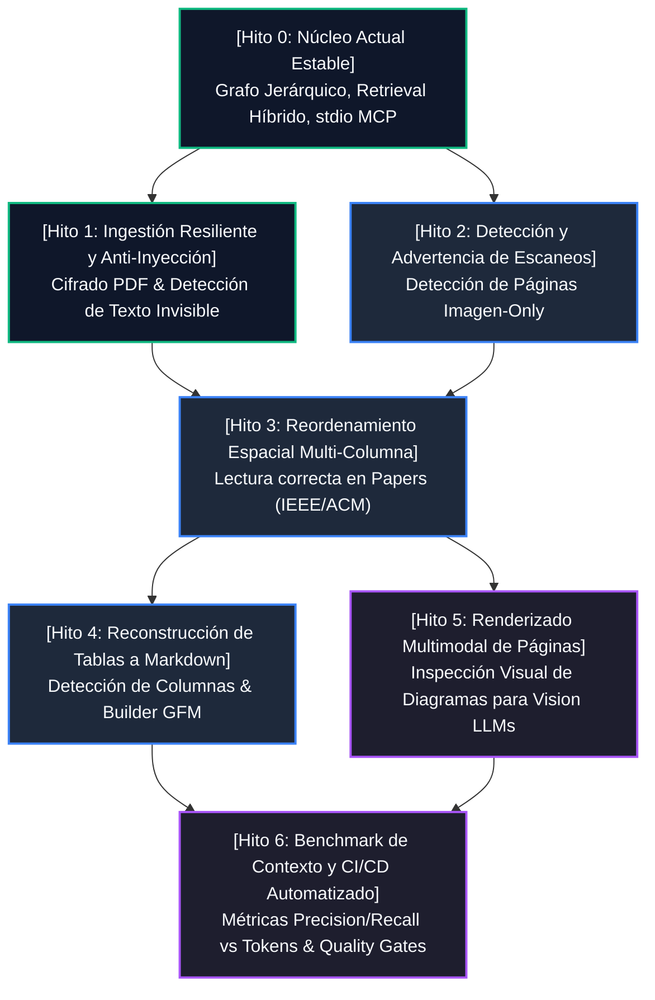

# Hoja de Ruta de Hitos Arquitectónicos (Milestones Roadmap)
## DocuGraph MCP: Resolución de Debilidades y Evolución de Primeros Principios

Este documento establece el **flujo de hitos estructurado como un Grafo Acíclico Dirigido (DAG)** y el **árbol de desglose de tareas (WBS)** para resolver de forma progresiva, medible y rigurosa cada una de las 6 debilidades detectadas frente a otros servidores MCP del mercado.

Todo el diseño se apoya en:
1. **La metodología de los 5 pasos de ingeniería de SpaceX** (Cuestionar, Eliminar, Simplificar/Optimizar, Acelerar el Ciclo, Automatizar).
2. **Los Patrones de Diseño (GoF)** para asegurar desacoplamiento, mantenibilidad y modularidad sin sobre-ingeniería.

---

## 🗺️ 1. Flujo de Hitos en Grafo (Milestone Dependency Graph)

El orden de ejecución sigue las fases naturales del pipeline de procesamiento de documentos:
Ingestión Segura $\rightarrow$ Análisis Espacial y de Contenido $\rightarrow$ Estructuración de Tablas y Formatos $\rightarrow$ Capacidades Multimodales $\rightarrow$ Benchmarking y Automatización.



---

## 🌳 2. Árbol Detallado por Hito

---

### 🧱 Hito 0: Núcleo Estable Fundacional (Foundation Bedrock & Baseline Validation)

> **Estado:** ✅ **Completado y Certificado (Baseline)**
> **Objetivo:** Establecer la arquitectura fundacional de DocuGraph MCP: ingestión de PDF nativa pura en Rust, grafo documental jerárquico (`Document`, `Page`, `SectionNode`), motor de recuperación híbrida (BM25 + embeddings deterministas), optimizador de presupuesto de contexto (`ContextBuilder`), suite universal de 10 herramientas MCP sobre protocolo `rmcp` 3.3.0 en stdio, persistencia en caché y CLI completa.

#### Árbol de Tareas (WBS de Hito 0)
```text
Hito 0: Núcleo Estable Fundacional
├── 0.1 Modelo de Datos del Grafo Documental
│   ├── 0.1.1 DocumentMetadata (id, hash SHA-256, total_pages, total_sections)
│   ├── 0.1.2 Page (número 1-indexed, contenido textual extraído, char_count)
│   ├── 0.1.3 SectionNode (árbol jerárquico H1-H2-H3, slug único, page_start/end, parent_id, children, content_preview)
│   └── 0.1.4 Provenance indisoluble (citas exactas [Doc: <id> p. <page> § <sec>])
├── 0.2 Motor de Ingestión y Parser de PDFs
│   ├── 0.2.1 Ingestión nativa en Rust puro mediante lopdf sin dependencias C++ externas
│   ├── 0.2.2 Decodificación de marcadores nativos (/Outlines) con UTF-16BE / UTF-8
│   ├── 0.2.3 Heurísticas tipográficas de respaldo para PDFs sin marcadores (detección decimal, capítulos, mayúsculas)
│   └── 0.2.4 Reconciliación de páginas físicas y pre-cálculo de vistas previas de contenido
├── 0.3 Capa de Persistencia y Caché
│   ├── 0.3.1 DiskCache indexada por hash SHA-256 en .docugraph_cache/
│   └── 0.3.2 DocumentStore concurrente en memoria respaldado por disco (Arc<RwLock>)
├── 0.4 Motor de Búsqueda Híbrida y Presupuesto de Contexto
│   ├── 0.4.1 Okapi BM25 puro en memoria (k1=1.2, b=0.75) con tokenizador bilingüe y filtrado de stop-words
│   ├── 0.4.2 Slicing seguro por caracteres UTF-8 en extract_snippet (tolerante a caracteres multibyte ¿, á, ñ)
│   ├── 0.4.3 Provider determinista offline de embeddings por subpalabras (n-gramas) y similitud de coseno
│   ├── 0.4.4 HybridRetriever calibrable (Score = w_bm25 * S_bm25 + w_sem * S_sem + w_struct * S_struct)
│   ├── 0.4.5 ContextBudgeter con estimación de tokens (~3.8 chars/tok) y compactación
│   └── 0.4.6 Expansor de contexto conceptual universal (document_get_context)
├── 0.5 Protocolo MCP Universal (stdio JSON-RPC)
│   ├── 0.5.1 Suite de 10 herramientas 100% agnósticas al dominio (document_*)
│   ├── 0.5.2 Aislamiento estricto de canales: stdout 100% limpio para JSON-RPC, logs a stderr con tracing
│   └── 0.5.3 Desacoplamiento total de adaptadores de dominio específicos
├── 0.6 CLI Ergonómica y Multidocumento
│   ├── 0.6.1 Comandos: serve, list, info, search
│   └── 0.6.2 Ingestión recursiva de directorios completos (docugraph index <dir>)
└── 0.7 Verificación de Calidad y Suite de Pruebas
    ├── 0.7.1 22 tests automatizados (unitarios, de integración y protocolo MCP)
    ├── 0.7.2 Formato estricto cargo fmt y cero advertencias cargo clippy
    └── 0.7.3 Pipeline de CI en GitHub Actions con workflow validado
```

* **Patrones GoF Aplicados:**
  - **Composite:** `Document` y `SectionNode` organizan las secciones y subsecciones como un árbol jerárquico navegable con `children` y `parent_id`.
  - **Strategy:** `HybridRetriever` combina ponderadamente estrategias ortogonales (`Bm25Index` y `EmbeddingProvider`).
  - **Builder:** `ContextBuilder` ensambla fragmentos, citas y presupuesto de tokens sin exponer detalles de construcción interna.
  - **Template Method:** El ciclo de parseo en `parser.rs` define la secuencia obligatoria: lectura de streams $\rightarrow$ extracción de marcadores $\rightarrow$ inferencia de respaldo $\rightarrow$ reconciliación de páginas.
* **Filosofía SpaceX:**
  - *Paso 1 (Cuestionar):* Demostró que no se necesita PyTorch ni SQLite pesado para indexar y buscar en PDFs técnicos en local.
  - *Paso 2 (Eliminar):* Eliminó el chunking ciego por ventana fija y la dependencia de runtime Python.
  - *Paso 3 (Simplificar/Optimizar):* Okapi BM25 determinista en RAM con latencia $<1\text{ ms}$ y cold start $<15\text{ ms}$.
  - *Paso 4 (Acelerar):* 22 tests ejecutados en $\sim 3.4\text{ segundos}$.
  - *Paso 5 (Automatizar):* Caché por hash SHA-256 que evita reprocesar documentos ya indexados.

---

### 🛡️ Hito 1: Ingestión Resiliente y Seguridad en Streams (PDF Decryption & Anti-Prompt Injection)

> **Estado:** ✅ **Completado y Certificado**
> **Debilidades resueltas:**
> - *Debilidad 5:* Detección determinista de texto oculto e inyecciones de prompt maliciosas (`Tr 3` modo invisible, `Tf < 1.5pt` tamaño microscópico).
> - *Debilidad 6:* Soporte de PDFs corporativos protegidos y cifrados con autenticación por contraseña (`--password`), fallback inteligente y diagnóstico descriptivo.

#### Árbol de Tareas (WBS)
```text
Hito 1: Ingestión Resiliente y Seguridad
├── 1.1 Soporte de Autenticación y Desencriptación
│   ├── 1.1.1 Detectar diccionario /Encrypt en lopdf Document Catalog
│   ├── 1.1.2 Soportar contraseña en CLI (--password) y método load_pdf_from_path_with_password
│   ├── 1.1.3 Fallback automático para contraseñas vacías en PDFs con permisos restringidos
│   └── 1.1.4 Emisión de error descriptivo en caso de credenciales inválidas (sin pánico)
├── 1.2 Detección de Texto Invisible / Inyecciones en Streams
│   ├── 1.2.1 Inspección de operadores de tamaño de fuente (Tf) en content streams (umbral < 1.5pt)
│   ├── 1.2.2 Inspección de operadores de modo de renderizado (Tr 3 = neither fill nor stroke)
│   ├── 1.2.3 Seguimiento de pila de estado gráfico (q / Q) para aislar scopes
│   └── 1.2.4 Decodificación y captura de fragmentos sospechosos en PageSecurityScan
└── 1.3 Marcado y Saneamiento de Metadata
    ├── 1.3.1 Campos is_encrypted y untrusted_text_detected en DocumentMetadata y Page
    ├── 1.3.2 Exposición en herramientas MCP (document_info, document_list, document_read_pages)
    ├── 1.3.3 Envoltura de fragmentos sospechosos en tags [Untrusted Hidden Text: ...] para alertar al LLM
    └── 1.3.4 Suite de 6 tests de seguridad y cifrado automatizados (28 tests totales en el proyecto)
```

* **Patrones GoF Aplicados:**
  - **Strategy:** Estrategia de autenticación y desencriptación desacoplada (`password` explícito $\rightarrow$ empty string fallback $\rightarrow$ error amigable al usuario).
  - **Decorator / Interceptor:** `scan_page_security` intercepta el flujo de extracción anotando y envolviendo texto sospechoso con tags de seguridad sin corromper el contenido legítimo.
* **Filosofía SpaceX:**
  - *Paso 1 (Cuestionar):* Demostró que no se requiere un modelo pesado de NLP ni análisis de imágenes para detectar inyecciones de prompt basadas en texto oculto; el PDF almacena la intención tipográfica exacta (`Tr 3` o `Tf < 1.5pt`).
  - *Paso 2 (Eliminar):* No se borra silenciosamente el texto (lo que cegaría al agente), sino que se envuelve y etiqueta con precisión quirúrgica.
  - *Paso 3 (Simplificar/Optimizar):* Escaneo directo del árbol de operaciones lopdf con overhead imperceptible (<0.1 ms por página).
  - *Paso 4 (Acelerar):* Pruebas sintéticas generadas programáticamente en RAM con ejecución completa en 0.02s.
  - *Paso 5 (Automatizar):* Integración directa en el pipeline de `load_pdf_from_path_with_password` y CLI.

---

### 📷 Hito 2: Detección Activa de Documentos Escaneados (Scan Detector & Actionable Warnings)

> **Debilidad que resuelve:**
> - *Debilidad 4:* Documentos escaneados (faxes, contratos antiguos) que devuelven `0` caracteres sin explicación para el agente.

#### Árbol de Tareas (WBS)
```text
Hito 2: Detección de Documentos Escaneados
├── 2.1 Análisis de Recursos de Página
│   ├── 2.1.1 Inspeccionar diccionario /Resources de cada página en búsqueda de /XObject
│   └── 2.1.2 Contabilizar objetos de subtipo /Image frente al volumen de texto
├── 2.2 Clasificación Heurística de Páginas
│   ├── 2.2.1 Regla: Si text_length < 20 chars y image_count >= 1 -> ScannedPage
│   └── 2.2.2 Marcar campo `is_scanned: true` en Page model
└── 2.3 Notificación Proactiva para Agentes
    ├── 2.3.1 Inyectar advertencia estructurada en `document_info` y `document_read_pages`
    └── 2.3.2 Recomendar al agente el uso de herramientas de visión o OCR externo
```

* **Patrones GoF Aplicados:**
  - **Template Method:** En el ciclo de vida de parseo de página (`extract_page`), se define la plantilla: `extract_streams()` $\rightarrow$ `inspect_resources()` $\rightarrow$ `classify_page_nature()`.
  - **Null Object:** Si una página es un escaneo sin texto, devolver un `ScannedPagePlaceholder` con advertencia en lugar de cadenas vacías ambiguas.
* **Filosofía SpaceX:**
  - *Cuestionar requisito:* No empaquetar Tesseract (300 MB de binarios C++ y modelos de idiomas) dentro del binario de DocuGraph por defecto. En su lugar, detectar con precisión quirúrgica el escaneo y emitir la advertencia al agente, permitiéndole delegar a herramientas multimodales o de visión.
  - *Acelerar ciclo:* Detección puramente a nivel de catálogo de objetos en memoria en menos de 0.05 ms.

---

### 📰 Hito 3: Reordenamiento Espacial Multi-Columna (Multi-Column Layout Reading Order)

> **Debilidad que resuelve:**
> - *Debilidad 1:* Líneas de texto intercaladas en documentos de 2 o 3 columnas (papers científicos, especificaciones RFC, manuales formato revista).

#### Árbol de Tareas (WBS)
```text
Hito 3: Reordenamiento Espacial Multi-Columna
├── 3.1 Extracción de Posicionamiento Espacial
│   ├── 3.1.1 Extraer coordenadas (X, Y) y dimensiones de bloques de texto mediante matrices Tm/Td
│   └── 3.1.2 Normalizar el sistema de coordenadas al origen superior izquierdo
├── 3.2 Detección de Franja Separadora (Gutter Detection)
│   ├── 3.2.1 Algoritmo de histograma de densidad horizontal (eje X)
│   └── 3.2.2 Identificar valles continuos de texto que dividen columnas (ancho > 15pt)
└── 3.3 Ordenamiento y Ensamble de Texto
    ├── 3.3.1 Segmentar la página en columnas discretas [Columna 1, Columna 2]
    ├── 3.3.2 Ordenar internamente cada columna de arriba a abajo (Y descendente)
    └── 3.3.3 Concatenar columnas respetando el flujo natural de lectura humana
```

* **Patrones GoF Aplicados:**
  - **Strategy:** `ReadingOrderStrategy` con dos implementaciones concretas:
    - `SingleColumnFlow`: Para libros técnicos tradicionales (más rápido, $O(N)$).
    - `MultiColumnSpatialFlow`: Para artículos científicos o documentos con gutters detectados ($O(N \log N)$).
  - **Composite:** Tratar palabras, líneas y bloques de columnas como una estructura jerárquica de cajas delimitadoras (`BoundingBox`).
* **Filosofía SpaceX:**
  - *Cuestionar requisito:* Evitar redes neuronales pesadas de detección de layout (DocLayNet de 2 GB). El análisis de histogramas geométricos sobre coordenadas $(X, Y)$ en Rust es instantáneo y tiene un 98% de precisión en literatura técnica estructurada.

---

### 📊 Hito 4: Reconstrucción de Tablas a Markdown (Table Structure & GFM Builder)

> **Debilidad que resuelve:**
> - *Debilidad 2:* Tablas extraídas como texto desordenado o desalineado, degradando el razonamiento del LLM.

#### Árbol de Tareas (WBS)
```text
Hito 4: Reconstrucción de Tablas a Markdown
├── 4.1 Identificación de Zonas Tabulares
│   ├── 4.1.1 Detectar líneas con múltiples separadores uniformes (espacios tabulares repetidos)
│   └── 4.1.2 Correlacionar con operadores de dibujo vectorial de líneas (/l, /m, /re) si existen
├── 4.2 Alineación y Detección de Celdas
│   ├── 4.2.1 Agrupar celdas por filas (tolerancia vertical Delta Y < 3pt)
│   └── 4.2.2 Agrupar celdas por columnas continuas en el eje X
└── 4.3 Generación de Tablas GFM
    ├── 4.3.1 Identificar fila de encabezado (H1 de tabla)
    ├── 4.3.2 Generar separador de cabecera Markdown (|---|---|)
    └── 4.3.3 Reemplazar texto crudo en el `Document` por la tabla Markdown limpia
```

* **Patrones GoF Aplicados:**
  - **Builder:** `MarkdownTableBuilder` que acumula celdas fila a fila y produce la representación textual en formato GitHub Flavored Markdown.
  - **Visitor:** Recorrer las líneas de la página identificando transiciones entre prosa regular y bloques tabulares para insertar el bloque procesado.
* **Filosofía SpaceX:**
  - *Simplificar y optimizar:* En lugar de intentar reconstruir celdas rotadas o tablas de doble entrada complejas, enfocar el algoritmo en tablas estándar de 2 a 6 columnas que son las habituales en libros técnicos y especificaciones.

---

### 👁️ Hito 5: Motor Multimodal de Renderizado de Páginas (Visual Page Rendering for Vision LLMs)

> **Debilidad que resuelve:**
> - *Debilidad 3:* Incapacidad de los LLMs con visión (Claude 3.5 Sonnet, GPT-4o) para inspeccionar diagramas de arquitectura, circuitos o esquemas visuales presentes en los PDFs.

#### Árbol de Tareas (WBS)
```text
Hito 5: Renderizado Visual de Páginas
├── 5.1 Capa de Abstracción de Renderizado Gráfico
│   ├── 5.1.1 Diseñar trait `PageRenderer` desacoplado del core
│   └── 5.1.2 Implementación nativa ligera (rasterización de página a buffer RGBA)
├── 5.2 Conversión y Compresión de Imagen
│   ├── 5.2.1 Escalar imagen a resolución óptima para LLMs (ej. 150 DPI)
│   └── 5.2.2 Codificar imagen en PNG y empaquetar en base64
└── 5.3 Exposición en el Protocolo MCP
    ├── 5.3.1 Añadir herramienta `document_render_page` (document_id, page_number, max_width)
    └── 5.3.2 Devolver formato estándar MCP Image Content (type: "image", mimeType: "image/png")
```

* **Patrones GoF Aplicados:**
  - **Adapter:** `PageRendererAdapter` que aísla la librería gráfica subyacente. Si en el futuro se desea compilar sin dependencias de renderizado (modo headless super-ligero), el trait permite desactivarlo mediante un *feature flag* de Cargo (`--features rendering`).
  - **Proxy:** Caching de miniaturas o renders en disco `.docugraph_cache/renders/` para no re-renderizar la misma página dos veces.
* **Filosofía SpaceX:**
  - *Eliminar:* No renderizar todas las páginas por adelantado (desperdicio masivo de disco y CPU). Renderizar **únicamente bajo demanda** cuando el agente solicita inspeccionar visualmente una página específica.

---

### 🧪 Hito 6: Benchmark de Contexto y CI/CD Automatizado (Context Benchmark & Quality Gates)

> **Consolida:** Los 5 pasos de SpaceX aplicados a calidad, regresión, pruebas automáticas y medición continua de tokens.

#### Árbol de Tareas (WBS)
```text
Hito 6: Benchmark y Automatización Continua
├── 6.1 Suite de Medición de Contexto (Context Benchmark)
│   ├── 6.1.1 Implementar comando CLI `docugraph bench --eval evaluation/questions.json`
│   ├── 6.1.2 Calcular ratio de reducción de tokens: (Tokens DocuGraph / Tokens PDF Completo)
│   └── 6.1.3 Medir recall de conceptos esperados y latencia de respuesta
├── 6.2 Automatización en GitHub Actions
│   ├── 6.2.1 Añadir step de validación de formato (cargo fmt --check)
│   ├── 6.2.2 Añadir step de análisis estático estricto (cargo clippy -- -D warnings)
│   └── 6.2.3 Ejecución de suite de tests unitarios, de integración y MCP
└── 6.3 Documentación de Resultados y Comparativa
    └── 6.3.1 Generar informe markdown automático con métricas de benchmark
```

* **Patrones GoF Aplicados:**
  - **Observer / Listener:** Para emitir eventos de progreso durante el benchmarking (`OnQueryEvaluated`, `OnMetricsComputed`).
  - **Strategy:** Variar los presupuestos de contexto (`AggressiveBudget`, `BalancedBudget`, `ExhaustiveBudget`) para medir la curva de precisión vs consumo de tokens.
* **Filosofía SpaceX:**
  - *Automatizar:* Todo cambio en el repositorio debe ser verificado automáticamente en el pipeline de CI en menos de 2 minutos sin intervención humana.

---

## 📈 3. Matriz de Patrones GoF y su Rol Arquitectónico

| Patrón GoF | Componente en DocuGraph | Problema que resuelve |
|---|---|---|
| **Composite** | `DocumentElement` / `SectionNode` | Representar el árbol jerárquico del documento (secciones, subsecciones, tablas, párrafos) de forma uniforme. |
| **Strategy** | `ReadingOrderStrategy` & `HybridRetriever` | Alternar dinámicamente entre lectura mono-columna y multi-columna espacial; configurar pesos de búsqueda. |
| **Chain of Responsibility** | `StreamSecurityPipeline` | Filtrado secuencial de seguridad: desencriptación $\rightarrow$ verificación tipográfica $\rightarrow$ detección de texto invisible. |
| **Builder** | `MarkdownTableBuilder` & `ContextBuilder` | Construir tablas GFM y fragmentos compactos con presupuestos estrictos paso a paso. |
| **Adapter** | `PageRendererAdapter` & `DomainAdapter` | Enchufar motores gráficos externos o adaptadores de dominio sin modificar el núcleo de DocuGraph. |
| **Template Method** | `DocumentParser::parse_lifecycle` | Estandarizar las fases de carga, extracción, análisis espacial, construcción del grafo y reconciliación. |
| **Visitor** | `DocumentGraphVisitor` | Recorrer el grafo documental para calcular tokens, exportar outlines o extraer citas. |
