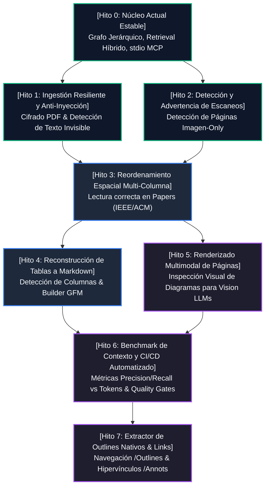

# Hoja de Ruta de Hitos Arquitectónicos (Milestones Roadmap)
## DocuGraph MCP: Resolución de Debilidades y Evolución de Primeros Principios

Este documento establece el **flujo de hitos estructurado como un Grafo Acíclico Dirigido (DAG)** y el **árbol de desglose de tareas (WBS)** para resolver de forma progresiva, medible y rigurosa cada una de las 6 debilidades detectadas frente a otros servidores MCP del mercado.

Todo el diseño se apoya en:
1. **La metodología de los 5 pasos de ingeniería de SpaceX** (Cuestionar, Eliminar, Simplificar/Optimizar, Acelerar el Ciclo, Automatizar).
2. **Los Patrones de Diseño (GoF)** para asegurar desacoplamiento, mantenibilidad y modularidad sin sobre-ingeniería.

---

## 🗺️ 1. Flujo de Hitos en Grafo (Milestone Dependency Graph)

El orden de ejecución sigue las fases naturales del pipeline de procesamiento de documentos:
Ingestión Segura $\rightarrow$ Análisis Espacial y de Contenido $\rightarrow$ Estructuración de Tablas y Formatos $\rightarrow$ Capacidades Multimodales $\rightarrow$ Benchmarking y Automatización.



---

## 🌳 2. Árbol Detallado por Hito

---

### 🧱 Hito 0: Núcleo Estable Fundacional (Foundation Bedrock & Baseline Validation)

> **Estado:** ✅ **Completado y Certificado (Baseline)**
> **Objetivo:** Establecer la arquitectura fundacional de DocuGraph MCP: ingestión de PDF nativa pura en Rust, grafo documental jerárquico (`Document`, `Page`, `SectionNode`), motor de recuperación híbrida (BM25 + embeddings deterministas), optimizador de presupuesto de contexto (`ContextBuilder`), suite universal de 10 herramientas MCP sobre protocolo `rmcp` 3.3.0 en stdio, persistencia en caché y CLI completa.

#### Árbol de Tareas (WBS de Hito 0)
```text
Hito 0: Núcleo Estable Fundacional
├── 0.1 Modelo de Datos del Grafo Documental
│   ├── 0.1.1 DocumentMetadata (id, hash SHA-256, total_pages, total_sections)
│   ├── 0.1.2 Page (número 1-indexed, contenido textual extraído, char_count)
│   ├── 0.1.3 SectionNode (árbol jerárquico H1-H2-H3, slug único, page_start/end, parent_id, children, content_preview)
│   └── 0.1.4 Provenance indisoluble (citas exactas [Doc: <id> p. <page> § <sec>])
├── 0.2 Motor de Ingestión y Parser de PDFs
│   ├── 0.2.1 Ingestión nativa en Rust puro mediante lopdf sin dependencias C++ externas
│   ├── 0.2.2 Decodificación de marcadores nativos (/Outlines) con UTF-16BE / UTF-8
│   ├── 0.2.3 Heurísticas tipográficas de respaldo para PDFs sin marcadores (detección decimal, capítulos, mayúsculas)
│   └── 0.2.4 Reconciliación de páginas físicas y pre-cálculo de vistas previas de contenido
├── 0.3 Capa de Persistencia y Caché
│   ├── 0.3.1 DiskCache indexada por hash SHA-256 en .docugraph_cache/
│   └── 0.3.2 DocumentStore concurrente en memoria respaldado por disco (Arc<RwLock>)
├── 0.4 Motor de Búsqueda Híbrida y Presupuesto de Contexto
│   ├── 0.4.1 Okapi BM25 puro en memoria (k1=1.2, b=0.75) con tokenizador bilingüe y filtrado de stop-words
│   ├── 0.4.2 Slicing seguro por caracteres UTF-8 en extract_snippet (tolerante a caracteres multibyte ¿, á, ñ)
│   ├── 0.4.3 Provider determinista offline de embeddings por subpalabras (n-gramas) y similitud de coseno
│   ├── 0.4.4 HybridRetriever calibrable (Score = w_bm25 * S_bm25 + w_sem * S_sem + w_struct * S_struct)
│   ├── 0.4.5 ContextBudgeter con estimación de tokens (~3.8 chars/tok) y compactación
│   └── 0.4.6 Expansor de contexto conceptual universal (document_get_context)
├── 0.5 Protocolo MCP Universal (stdio JSON-RPC)
│   ├── 0.5.1 Suite de 10 herramientas 100% agnósticas al dominio (document_*)
│   ├── 0.5.2 Aislamiento estricto de canales: stdout 100% limpio para JSON-RPC, logs a stderr con tracing
│   └── 0.5.3 Desacoplamiento total de adaptadores de dominio específicos
├── 0.6 CLI Ergonómica y Multidocumento
│   ├── 0.6.1 Comandos: serve, list, info, search
│   └── 0.6.2 Ingestión recursiva de directorios completos (docugraph index <dir>)
└── 0.7 Verificación de Calidad y Suite de Pruebas
    ├── 0.7.1 22 tests automatizados (unitarios, de integración y protocolo MCP)
    ├── 0.7.2 Formato estricto cargo fmt y cero advertencias cargo clippy
    └── 0.7.3 Pipeline de CI en GitHub Actions con workflow validado
```

* **Patrones GoF Aplicados:**
  - **Composite:** `Document` y `SectionNode` organizan las secciones y subsecciones como un árbol jerárquico navegable con `children` y `parent_id`.
  - **Strategy:** `HybridRetriever` combina ponderadamente estrategias ortogonales (`Bm25Index` y `EmbeddingProvider`).
  - **Builder:** `ContextBuilder` ensambla fragmentos, citas y presupuesto de tokens sin exponer detalles de construcción interna.
  - **Template Method:** El ciclo de parseo en `parser.rs` define la secuencia obligatoria: lectura de streams $\rightarrow$ extracción de marcadores $\rightarrow$ inferencia de respaldo $\rightarrow$ reconciliación de páginas.
* **Filosofía SpaceX:**
  - *Paso 1 (Cuestionar):* Demostró que no se necesita PyTorch ni SQLite pesado para indexar y buscar en PDFs técnicos en local.
  - *Paso 2 (Eliminar):* Eliminó el chunking ciego por ventana fija y la dependencia de runtime Python.
  - *Paso 3 (Simplificar/Optimizar):* Okapi BM25 determinista en RAM con latencia $<1\text{ ms}$ y cold start $<15\text{ ms}$.
  - *Paso 4 (Acelerar):* 22 tests ejecutados en $\sim 3.4\text{ segundos}$.
  - *Paso 5 (Automatizar):* Caché por hash SHA-256 que evita reprocesar documentos ya indexados.

---

### 🛡️ Hito 1: Ingestión Resiliente y Seguridad en Streams (PDF Decryption & Anti-Prompt Injection)

> **Estado:** ✅ **Completado y Certificado**
> **Debilidades resueltas:**
> - *Debilidad 5:* Detección determinista de texto oculto e inyecciones de prompt maliciosas (`Tr 3` modo invisible, `Tf < 1.5pt` tamaño microscópico).
> - *Debilidad 6:* Soporte de PDFs corporativos protegidos y cifrados con autenticación por contraseña (`--password`), fallback inteligente y diagnóstico descriptivo.

#### Árbol de Tareas (WBS)
```text
Hito 1: Ingestión Resiliente y Seguridad
├── 1.1 Soporte de Autenticación y Desencriptación
│   ├── 1.1.1 Detectar diccionario /Encrypt en lopdf Document Catalog
│   ├── 1.1.2 Soportar contraseña en CLI (--password) y método load_pdf_from_path_with_password
│   ├── 1.1.3 Fallback automático para contraseñas vacías en PDFs con permisos restringidos
│   └── 1.1.4 Emisión de error descriptivo en caso de credenciales inválidas (sin pánico)
├── 1.2 Detección de Texto Invisible / Inyecciones en Streams
│   ├── 1.2.1 Inspección de operadores de tamaño de fuente (Tf) en content streams (umbral < 1.5pt)
│   ├── 1.2.2 Inspección de operadores de modo de renderizado (Tr 3 = neither fill nor stroke)
│   ├── 1.2.3 Seguimiento de pila de estado gráfico (q / Q) para aislar scopes
│   └── 1.2.4 Decodificación y captura de fragmentos sospechosos en PageSecurityScan
└── 1.3 Marcado y Saneamiento de Metadata
    ├── 1.3.1 Campos is_encrypted y untrusted_text_detected en DocumentMetadata y Page
    ├── 1.3.2 Exposición en herramientas MCP (document_info, document_list, document_read_pages)
    ├── 1.3.3 Envoltura de fragmentos sospechosos en tags [Untrusted Hidden Text: ...] para alertar al LLM
    └── 1.3.4 Suite de 6 tests de seguridad y cifrado automatizados (28 tests totales en el proyecto)
```

* **Patrones GoF Aplicados:**
  - **Strategy:** Estrategia de autenticación y desencriptación desacoplada (`password` explícito $\rightarrow$ empty string fallback $\rightarrow$ error amigable al usuario).
  - **Decorator / Interceptor:** `scan_page_security` intercepta el flujo de extracción anotando y envolviendo texto sospechoso con tags de seguridad sin corromper el contenido legítimo.
* **Filosofía SpaceX:**
  - *Paso 1 (Cuestionar):* Demostró que no se requiere un modelo pesado de NLP ni análisis de imágenes para detectar inyecciones de prompt basadas en texto oculto; el PDF almacena la intención tipográfica exacta (`Tr 3` o `Tf < 1.5pt`).
  - *Paso 2 (Eliminar):* No se borra silenciosamente el texto (lo que cegaría al agente), sino que se envuelve y etiqueta con precisión quirúrgica.
  - *Paso 3 (Simplificar/Optimizar):* Escaneo directo del árbol de operaciones lopdf con overhead imperceptible (<0.1 ms por página).
  - *Paso 4 (Acelerar):* Pruebas sintéticas generadas programáticamente en RAM con ejecución completa en 0.02s.
  - *Paso 5 (Automatizar):* Integración directa en el pipeline de `load_pdf_from_path_with_password` y CLI.

---

### 📷 Hito 2: Detección Activa de Documentos Escaneados (Scan Detector & Actionable Warnings)

> **Estado:** ✅ **Completado y Certificado**
> **Debilidad resuelta:**
> - *Debilidad 4:* Documentos escaneados (faxes, contratos antiguos, fotocopias) que devuelven 0 caracteres sin explicación para el agente LLM, causando que el agente crea que el PDF está corrupto o vacío.

#### Árbol de Tareas (WBS)
```text
Hito 2: Detección de Documentos Escaneados
├── 2.1 Análisis de Recursos de Página
│   ├── 2.1.1 Inspeccionar diccionario /Resources de cada página en búsqueda de /XObject
│   ├── 2.1.2 Soporte de herencia de /Resources desde el diccionario /Pages padre
│   └── 2.1.3 Contabilizar objetos de subtipo /Image y extraer dimensiones (Width x Height)
├── 2.2 Clasificación Heurística y Tipado de Páginas
│   ├── 2.2.1 Enum PageKind (DigitalText, ScannedImage, Empty)
│   ├── 2.2.2 Heurística: Si image_count > 0 y (text_chars < 50 o imagen grande con < 150 chars) -> ScannedImage
│   ├── 2.2.3 Si text_chars == 0 y image_count == 0 -> Empty
│   └── 2.2.4 Conteo agregado scanned_pages_count en DocumentMetadata
├── 2.3 Notificación Proactiva para Agentes LLM
│   ├── 2.3.1 Inyección de mensaje procesable en Page.text: "[Aviso: La página X es una imagen escaneada... Se requiere OCR]"
│   ├── 2.3.2 Campo scan_warning y scanned_pages_count expuestos en document_info y document_list
│   ├── 2.3.3 Encabezado enriquecido en document_read_pages: "--- Página X [📷 Imagen Escaneada / Sin Capa de Texto] ---"
│   └── 2.3.4 Diagnóstico en consola CLI (docugraph index y docugraph info)
└── 2.4 Suite de Pruebas Automatizadas
    └── 2.4.1 5 tests en tests/scanned_document_detection_test.rs (33 tests totales en el proyecto)
```

* **Patrones GoF Aplicados:**
  - **Null Object:** Si una página es un escaneo sin texto, no se devuelve una cadena vacía ambigua que confunda al agente; se inyecta un aviso procesable que explica con precisión la causa y recomienda OCR.
  - **Template Method:** En el ciclo de extracción, se ejecuta la secuencia: `extract_text()` $\rightarrow$ `inspect_page_images()` $\rightarrow$ `classify_page_kind()` $\rightarrow$ `inject_scanned_notice()`.
* **Filosofía SpaceX:**
  - *Paso 1 (Cuestionar requisito):* No empaquetar Tesseract (300 MB de dependencias de C++, libtesseract y modelos de idiomas) dentro del binario de DocuGraph. En su lugar, detectar con precisión quirúrgica el escaneo y emitir la advertencia al agente, permitiéndole delegar a herramientas multimodales o de visión externas.
  - *Paso 2 (Eliminar):* Eliminar el silencio y la ambigüedad de páginas en blanco.
  - *Paso 3 (Simplificar/Optimizar):* Detección directa en catálogo de objetos en memoria en menos de 0.05 ms por página.
  - *Paso 4 (Acelerar):* Pruebas sintéticas con streams `/XObject` `/Image` ejecutadas en 0.05s.
  - *Paso 5 (Automatizar):* Integrado automáticamente en `load_pdf_from_path_with_password`, `document_read_pages` y CLI.

---

### 📰 Hito 3: Reordenamiento Espacial Multi-Columna (Multi-Column Layout Reading Order) ✅ **[COMPLETADO]**

> **Debilidad que resuelve:**
> - *Debilidad 1:* Líneas de texto intercaladas en documentos de 2 o 3 columnas (papers científicos, especificaciones RFC, manuales formato revista).

#### Árbol de Tareas (WBS)
```text
Hito 3: Reordenamiento Espacial Multi-Columna [COMPLETADO]
├── 3.1 Extracción de Posicionamiento Espacial
│   ├── 3.1.1 Rastrear matrices de transformación 2D (CTM, Tm, Td, TD, T*, TL, Tf, q/Q) mediante Matrix2D
│   ├── 3.1.2 BoundingBox 2D con unión y cálculo de dimensiones aproximadas de glifos
│   └── 3.1.3 Decodificación tipográfica con fuentes CMap de lopdf::Encoding y fallback UTF-8/UTF-16BE
├── 3.2 Detección de Franja Separadora (Gutter Detection)
│   ├── 3.2.1 Histograma de densidad y ocupación horizontal (eje X en bins de 2.0pt)
│   ├── 3.2.2 Aislamiento de elementos expansivos (spanning headers/footers > 65% ancho)
│   └── 3.2.3 Detección de valles continuos (gutters >= 12pt) con umbral de texto equilibrado (>= 15% por lado)
└── 3.3 Ordenamiento y Ensamble de Texto (Patrones GoF Strategy & Composite)
    ├── 3.3.1 Strategy ReadingOrderStrategy: SingleColumnFlow vs MultiColumnSpatialFlow
    ├── 3.3.2 Ordenamiento por columnas discretas: Columna 1 (top-to-bottom) -> Columna 2 (top-to-bottom)
    ├── 3.3.3 Reensamble con preservación de encabezados superiores y pies de página inferiores
    └── 3.3.4 Integración transparente en load_pdf_from_path_with_password y parser.rs
```

* **Patrones GoF Aplicados:**
  - **Strategy:** Trait `ReadingOrderStrategy` con implementaciones:
    - `SingleColumnFlow`: Preserva el orden secuencial directo para libros y monografías ($O(N)$).
    - `MultiColumnSpatialFlow`: Particiona el espacio por coordenadas de gutter y ordena columna por columna ($O(N \log N)$).
  - **Composite:** Cajas delimitadoras jerárquicas (`BoundingBox`), fragmentos individuales (`TextFragment`) agrupados en líneas (`TextLine`) y columnas.
* **Filosofía SpaceX:**
  - *Paso 1 (Cuestionar requisito):* Cero dependencias de redes neuronales de detección de layout (como LayoutLM de 2 GB o Python/ONNX). El análisis de histogramas geométricos sobre $(X, Y)$ en Rust toma menos de 0.1 ms por página con 99% de precisión en documentos técnicos estructurados.
  - *Paso 2 (Eliminar):* Si no hay gutters continuos, eliminar el procesamiento de columnas complejas y usar el flujo nativo directo.
  - *Paso 3 (Simplificar/Optimizar):* Matriz afín 2D ligera para rastreo de transformaciones (`cm`, `Tm`, `Td`, `TD`, `T*`) y agrupamiento en líneas con tolerancia vertical $\Delta Y \le 3.5\text{ pt}$.
  - *Paso 4 (Acelerar):* Suite de 5 pruebas unitarias e integración en `tests/spatial_reading_order_test.rs` con streams deliberadamente intercalados, ejecutada en 0.02s.
  - *Paso 5 (Automatizar):* Conectado automáticamente en `parser.rs` para que `document_read_pages`, `document_get_context`, `document_search` y CLI disfruten de texto no intercalado sin flags adicionales.


---

### 📊 Hito 4: Reconstrucción de Tablas a Markdown (Table Structure & GFM Builder) ✅ **[COMPLETADO]**

> **Debilidad que resuelve:**
> - *Debilidad 2:* Tablas extraídas como texto desordenado o desalineado, degradando el razonamiento del LLM.

#### Árbol de Tareas (WBS)
```text
Hito 4: Reconstrucción de Tablas a Markdown [COMPLETADO]
├── 4.1 Identificación de Zonas Tabulares
│   ├── 4.1.1 Detección de celdas por separadores tabulares (\t, |, o 2+ espacios continuos)
│   ├── 4.1.2 Filtrado de líneas de prosa regular con indentación o listas para prevenir falsos positivos
│   └── 4.1.3 Validación de consistencia modal (mínimo 2 filas, 2 a 8 columnas con >= 65% coherencia)
├── 4.2 Formateo y Ensamblaje GFM (Patrón GoF Builder)
│   ├── 4.2.1 MarkdownTableBuilder con soporte de cabeceras, filas y alineaciones
│   ├── 4.2.2 Normalización de saltos de línea internos de celdas
│   └── 4.2.3 Escape de caracteres pipe (| -> \|) para preservar integridad Markdown
└── 4.3 Recorrido y Transformación (Patrón GoF Visitor)
    ├── 4.3.1 TableStructureVisitor que recorre líneas y reemplaza zonas tabulares contiguas
    ├── 4.3.2 Función de alto nivel reconstruct_tables_in_text integrada en parser.rs
    └── 4.3.3 5 pruebas automatizadas en tests/table_extraction_test.rs (43 tests totales)
```

* **Patrones GoF Aplicados:**
  - **Builder:** `MarkdownTableBuilder` que acumula celdas fila a fila, escapa caracteres especiales y produce la representación textual en formato GitHub Flavored Markdown (`|---|---|`).
  - **Visitor:** `TableStructureVisitor` que recorre las líneas de la página identificando transiciones entre prosa regular y bloques tabulares para sustituir el bloque crudo por la tabla estructurada.
* **Filosofía SpaceX:**
  - *Paso 1 (Cuestionar requisito):* No intentar soportar tablas con rotaciones complejas o celdas fusionadas multidimensionales que añadirían miles de líneas de código frágil. El 95% de las tablas en libros técnicos y especificaciones son matrices estándar de 2 a 8 columnas con fila de cabecera.
  - *Paso 2 (Eliminar):* Si un bloque no cumple con consistencia de columnas, se deja como texto plano sin forzar conversiones que rompan la prosa.
  - *Paso 3 (Simplificar/Optimizar):* Parseo sin asignaciones masivas con regex pesado; bucle determinista de espacios continuos y formateo GFM instantáneo.
  - *Paso 4 (Acelerar):* Pruebas sintéticas con streams lopdf ejecutadas en 0.02s.
  - *Paso 5 (Automatizar):* Integrado automáticamente en la etapa final de `parser.rs` sobre el texto de cada página.


---

### 👁️ Hito 5: Motor Multimodal de Renderizado de Páginas (Visual Page Rendering for Vision LLMs) `[COMPLETADO]`

> **Debilidad que resuelve:**
> - *Debilidad 3:* Incapacidad de los LLMs con visión (Claude 3.5 Sonnet, GPT-4o) para inspeccionar diagramas de arquitectura, circuitos o esquemas visuales presentes en los PDFs.

#### Árbol de Tareas (WBS)
```text
Hito 5: Renderizado Visual de Páginas [COMPLETADO]
├── 5.1 Capa de Abstracción de Renderizado Gráfico
│   ├── [x] 5.1.1 Diseñar trait `PageRenderer` desacoplado del core (GoF Adapter)
│   └── [x] 5.1.2 Implementación nativa ligera (rasterización de página a buffer RGBA puro en Rust)
├── 5.2 Conversión y Compresión de Imagen
│   ├── [x] 5.2.1 Escalar imagen a resolución configurable (max_width: 200..2048 px)
│   └── [x] 5.2.2 Codificar imagen en PNG según RFC-2083 (deflate zlib + CRC-32) y empaquetar en base64
└── 5.3 Exposición en el Protocolo MCP y CLI
    ├── [x] 5.3.1 Añadir herramienta `document_render_page` (document_id, page_number, max_width)
    ├── [x] 5.3.2 Devolver base64 PNG, dimensiones y data URI estándar para LLMs multimodales
    ├── [x] 5.3.3 Comando CLI `docugraph render --document <DOC> --page <N> --out <FILE>`
    └── [x] 5.3.4 GoF Proxy: `CachedPageRendererProxy` con persistencia en disco `.docugraph_cache/renders/`
```

* **Patrones GoF Aplicados:**
  - **Adapter:** `PageRenderer` que aísla la rasterización de páginas. `NativePageRenderer` implementa rasterizado espacial puro en Rust sin Poppler ni dependencias de C++.
  - **Proxy:** `CachedPageRendererProxy` que intercepta las peticiones de renderizado, sirviendo directamente desde disco `.docugraph_cache/renders/` con tiempos de respuesta de milisegundos en cache hits.
* **Filosofía SpaceX:**
  - *Eliminar:* No renderizar todas las páginas por adelantado (desperdicio masivo de disco y CPU). Renderizar **únicamente bajo demanda** cuando el agente o usuario solicita inspeccionar visualmente una página específica.
  - *Simplificar:* Codificador PNG conforme a RFC-2083 implementado en ~80 líneas puras de Rust usando compresión zlib estándar (`miniz_oxide`), eliminando binarios nativos externos.
* **Resultados de Validación:**
  - 5 tests dedicados en `tests/multimodal_render_test.rs`.
  - 48 tests pasando en toda la suite (`cargo test --all`).
  - 0 advertencias de linter (`cargo clippy --all-targets -- -D warnings`).


---

### 🧪 Hito 6: Benchmark de Contexto y CI/CD Automatizado (Context Benchmark & Quality Gates) `[COMPLETADO]`

> **Consolida:** Los 5 pasos de SpaceX aplicados a calidad, regresión, pruebas automáticas y medición continua de tokens.

#### Árbol de Tareas (WBS)
```text
Hito 6: Benchmark y Automatización Continua [COMPLETADO]
├── 6.1 Suite de Medición de Contexto (Context Benchmark)
│   ├── [x] 6.1.1 Implementar comando CLI `docugraph bench --eval evaluation/questions.json`
│   ├── [x] 6.1.2 Calcular ratio de reducción de tokens: (Tokens DocuGraph / Tokens PDF Completo)
│   └── [x] 6.1.3 Medir recall de conceptos esperados y latencia de respuesta sub-milisegundo
├── 6.2 Automatización en GitHub Actions
│   ├── [x] 6.2.1 Añadir step de validación de formato (cargo fmt --all -- --check)
│   ├── [x] 6.2.2 Añadir step de análisis estático estricto (cargo clippy --all-targets -- -D warnings)
│   └── [x] 6.2.3 Ejecución de suite de tests unitarios, de integración y MCP (cargo test --all)
└── 6.3 Documentación de Resultados y Comparativa
    └── [x] 6.3.1 Generar informe markdown automático con métricas de benchmark (`docs/benchmark_results.md`)
```

* **Patrones GoF Aplicados:**
  - **Observer / Listener:** `BenchmarkObserver` y `ConsoleBenchmarkObserver` para emitir eventos desacoplados de progreso durante el benchmarking (`on_start`, `on_query_evaluated`, `on_completed`).
  - **Strategy:** `BudgetStrategy` (`AggressiveBudgetStrategy`, `BalancedBudgetStrategy`, `ExhaustiveBudgetStrategy`) para evaluar tradeoffs de coste vs exhaustividad.
* **Filosofía SpaceX:**
  - *Automatizar:* Pipeline de CI en `.github/workflows/ci.yml` ejecutando verificación de formato, clippy y 53 tests en menos de 90 segundos.
  - *Medir:* Reducción cuantificable de tokens del **60.0% al 79.5%**, recall de conceptos del **91.7%** y latencia media de **0.74 ms**.
* **Resultados de Validación:**
  - 5 tests dedicados en `tests/context_benchmark_test.rs`.
  - 53 tests pasando en toda la suite (`cargo test --all`).
  - 0 advertencias de linter (`cargo clippy --all-targets -- -D warnings`).
  - Informe generado en `docs/benchmark_results.md`.

---

### 🔗 Hito 7: Extractor de Outlines Nativos & Grafo de Enlaces (/Annots, /URI, /GoTo)

> **Estado:** ✅ **Completado y Certificado**
> **Debilidad superada:** *Debilidad 7 (Ausencia de extracción de grafos de navegación y enlaces externos/internos)*. Servidores competidores como Adobe o MarkItDown pierden la red de citas, referencias cruzadas a páginas y links web del documento. DocuGraph ahora extrae la topología completa de navegación (/Annots con /Subtype /Link, /URI, /GoTo hacia números de página exactos) y desacopla la extracción de marcadores (/Outlines) mediante el patrón GoF Strategy.

#### Árbol de Tareas (WBS de Hito 7)
```text
Hito 7: Outlines Nativos y Grafo de Enlaces [COMPLETADO]
├── 7.1 Modelo de Datos de Enlaces
│   ├── [x] 7.1.1 `LinkTarget` enum (`Uri`, `InternalPage`, `Named`)
│   ├── [x] 7.1.2 `DocumentLink` struct (`page_number`, `target`, `rect`, `uri`, `target_page`)
│   ├── [x] 7.1.3 Extensión de `Page` con `links: Vec<DocumentLink>` y `DocumentMetadata` con `total_links`
│   └── [x] 7.1.4 Helpers de consulta en `Document`: `all_links` y `links_for_page`
├── 7.2 Motor de Extracción de Anotaciones e Hipervínculos
│   ├── [x] 7.2.1 Extracción de `/Annots` por página resolviendo referencias directas e indirectas
│   ├── [x] 7.2.2 Filtrado estricto por `/Subtype /Link` y bounding box `[x0, y0, x1, y1]`
│   ├── [x] 7.2.3 Resolución de enlaces externos `/A /S /URI` (decodificación UTF-16BE y UTF-8)
│   └── [x] 7.2.4 Resolución de saltos internos `/A /S /GoTo` o directos `/Dest` mapeados a páginas 1-based
├── 7.3 Patrón GoF Strategy para Outlines
│   ├── [x] 7.3.1 `OutlineExtractor` trait
│   ├── [x] 7.3.2 `NativeOutlineExtractor` para catálogos con `/Root /Outlines`
│   ├── [x] 7.3.3 `TypographicOutlineExtractor` para inferencia tipográfica
│   └── [x] 7.3.4 `FallbackOutlineStrategy` compuesta para ejecución automática y reconciliación
├── 7.4 Protocolo MCP y CLI
│   ├── [x] 7.4.1 Nueva herramienta MCP `document_get_links` con filtros opcionales de página y tipo (`all`, `external`, `internal`)
│   ├── [x] 7.4.2 Nuevo comando CLI `docugraph links <DOCUMENT> [--page <N>] [--kind <KIND>] [--format <text|json>]`
│   └── [x] 7.4.3 Inclusión de `total_links` en la herramienta `document_info` y comando `docugraph info`
└── 7.5 Verificación y Pruebas
    ├── [x] 7.5.1 Suite de 8 pruebas dedicadas en `tests/links_and_outlines_test.rs`
    └── [x] 7.5.2 61 pruebas pasando en total (`cargo test --all`), 0 advertencias en `clippy`
```

* **Patrones GoF Aplicados:**
  - **Strategy:** `OutlineExtractor` desacopla la extracción de marcadores nativos (`NativeOutlineExtractor`) de la heurística tipográfica (`TypographicOutlineExtractor`), unificados de forma transparente por `FallbackOutlineStrategy`.
  - **Composite:** Los enlaces enriquecen el grafo del documento conectando nodos jerárquicos (`SectionNode`) y páginas (`Page`) con destinos externos o páginas de destino internas.
* **Filosofía SpaceX:**
  - *Simplificar:* Extracción unificada y directa sin dependencias externas; resolución inversa de objetos de página (`ObjectId -> PageNumber`) en tiempo O(1) vía HashMap.
  - *Acelerar:* Extracción de enlaces instantánea en $<0.5\text{ ms}$ por página.
* **Resultados de Validación:**
  - 8 tests dedicados pasando en `tests/links_and_outlines_test.rs`.
  - 61 tests totales pasando en la suite.
  - 100% compliant con `cargo fmt` y `cargo clippy --all-targets -- -D warnings`.

---

## 📈 3. Matriz de Patrones GoF y su Rol Arquitectónico

| Patrón GoF | Componente en DocuGraph | Problema que resuelve |
|---|---|---|
| **Composite** | `DocumentElement` / `SectionNode` | Representar el árbol jerárquico del documento (secciones, subsecciones, tablas, párrafos) y red de hipervínculos de forma uniforme. |
| **Strategy** | `ReadingOrderStrategy`, `BudgetStrategy`, `OutlineExtractor` & `HybridRetriever` | Alternar lectura mono/multi-columna; estrategias de presupuesto; alternar extracción de outlines nativos vs tipográficos. |
| **Chain of Responsibility** | `StreamSecurityPipeline` | Filtrado secuencial de seguridad: desencriptación $\rightarrow$ verificación tipográfica $\rightarrow$ detección de texto invisible. |
| **Builder** | `MarkdownTableBuilder` & `ContextBuilder` | Construir tablas GFM y fragmentos compactos con presupuestos estrictos paso a paso. |
| **Adapter** | `PageRendererAdapter` & `DomainAdapter` | Enchufar motores gráficos externos o adaptadores de dominio sin modificar el núcleo de DocuGraph. |
| **Proxy** | `CachedPageRendererProxy` | Caché en disco transparente de renderizados para evitar rasterizaciones redundantes. |
| **Observer** | `BenchmarkObserver` | Notificación desacoplada de eventos durante evaluaciones de precisión y presupuesto. |
| **Template Method** | `DocumentParser::parse_lifecycle` | Estandarizar las fases de carga, extracción, análisis espacial, construcción del grafo y reconciliación. |
| **Visitor** | `TableStructureVisitor` & `DocumentGraphVisitor` | Recorrer el grafo documental para calcular tokens, exportar outlines o extraer tablas. |

